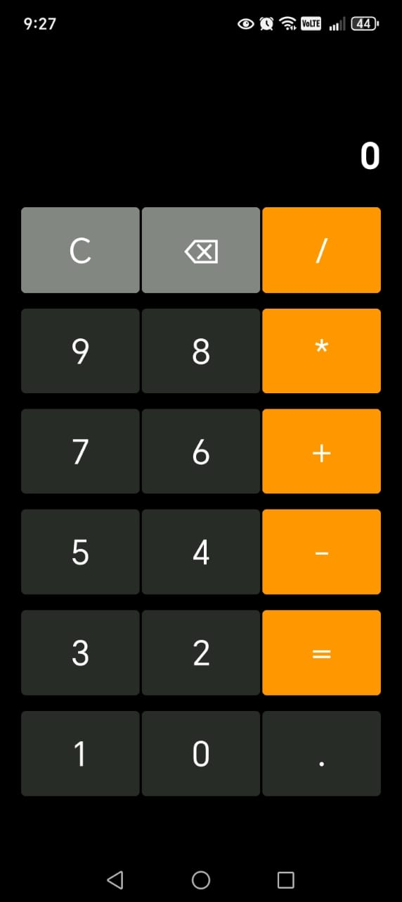
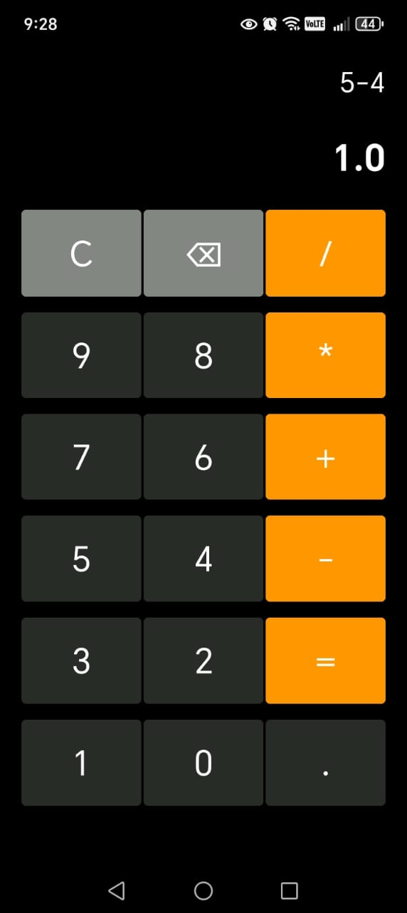
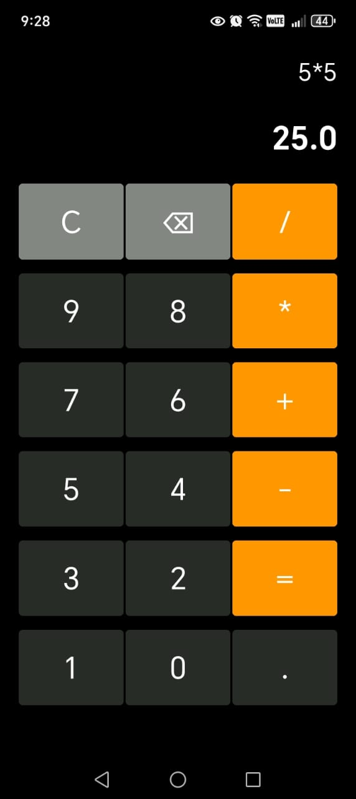
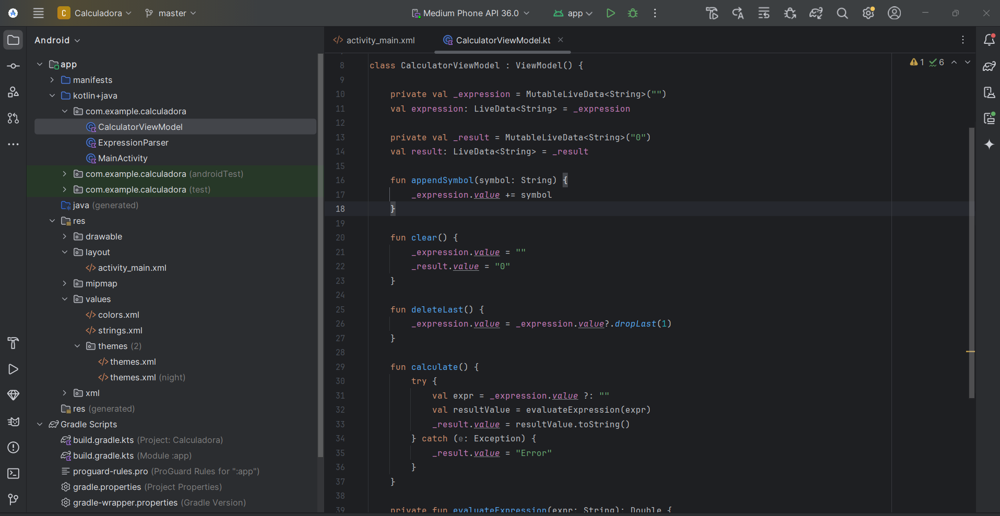
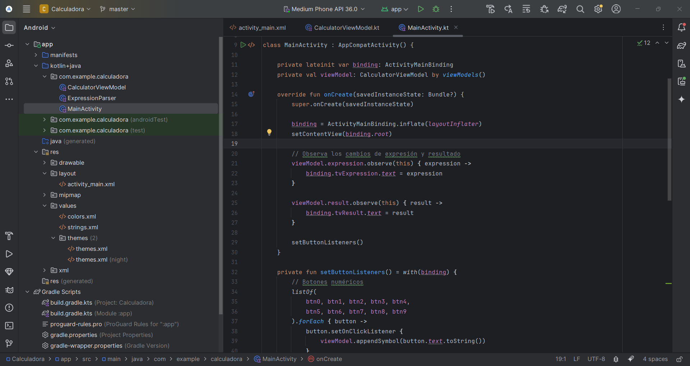

# 🧮 App Calculadora MVVM y LiveData

**Calculadora MVVM** es una app moderna construida con **Kotlin** para Android 13 (API 33), diseñada para ofrecer una experiencia de cálculo fluida, responsiva y visualmente atractiva.

Implementa el patrón arquitectónico **MVVM**, aprovechando las ventajas de `ViewModel` y `LiveData` para separar claramente la lógica del negocio y la interfaz de usuario. Además, utiliza **ViewBinding** para un acceso seguro y eficiente a los elementos de la vista.

Cuenta con una interfaz intuitiva construida con **ConstraintLayout** y **GridLayout**, botones personalizados mediante estilos, y compatibilidad con **modo oscuro**, todo bajo los lineamientos de **Material Design**.

La aplicación permite realizar operaciones matemáticas básicas como suma, resta, multiplicación y división, mostrando la expresión y el resultado en tiempo real con una interfaz limpia, centrada y optimizada para pantallas táctiles.

---

## 🎯 Objetivo

Construir una calculadora funcional y profesional aplicando buenas prácticas en arquitectura de software móvil:

- Utilizar ViewModel y LiveData para separación de lógica y UI
- Diseñar una interfaz moderna, responsiva y cómoda
- Soportar operaciones básicas (`+`, `−`, `×`, `÷`) con entrada dinámica
- Mostrar la expresión y el resultado en tiempo real

---

## 🚀 Funcionalidades

- ✅ Operaciones básicas (`+`, `-`, `*`, `/`)
- 🧠 Evaluación de expresiones usando parser en Kotlin puro (sin librerías externas)
- 👀 Actualización en tiempo real del resultado mientras se escribe
- 🗑️ Botón de borrado y reinicio
- 🔘 Botón para borrar último carácter (`⌫`)
- 🔣 Botón decimal (`.`)
- 🎨 Diseño moderno con botones personalizados y colores ajustados
- 📱 Distribución adaptable a pantallas táctiles
- 🌙 Compatible con modo oscuro

---

## 🧩 Arquitectura y Componentes

**MVVM (Model-View-ViewModel)**
  - `CalculatorViewModel.kt` – lógica de negocio y estado reactivo
  - `MainActivity.kt` – capa de presentación
**LiveData**
  - Observación de expresión y resultado
**ViewBinding**
  - Acceso limpio y seguro a vistas
**GridLayout**
  - Distribución ordenada de botones
**Estilos personalizados**
  - Botones con tamaños, márgenes y colores definidos en `styles.xml`

---

## 🎨 Estética y Usabilidad

- Botones grandes y separados
- Altura y ancho optimizados para interacción táctil
- Botones especiales con colores distintos (`=`, `C`, `⌫`)
- Uso de colores personalizados definidos en `colors.xml`
- Layout centrado y adaptable con `ConstraintLayout`

---

## 📂 Estructura del Proyecto
📁 app

└─ 📁 src

└─ 📁 main

├─ 📁 java/com/example/calculadora

│ ├── MainActivity.kt

│ └── CalculatorViewModel.kt

├─ 📁 res

│ ├── layout/activity_main.xml

│ ├── values/styles.xml

│ ├── values/colors.xml

│ └── values/themes.xml

└── AndroidManifest.xml

## 🛠️ Tecnologías utilizadas

- Kotlin + Android API 33
- ViewModel + LiveData (AndroidX)
- ViewBinding
- Material Design
- ConstraintLayout + GridLayout
- Parser de expresiones matemáticas (Postfix)
- Android Studio Hedgehog o superior

---

## 🖼️ Capturas de pantalla
---

### Vista principal Calculadora

---
### Vista Suma Calculadora

---
### Vista Resta Calculadora

---
### Vista Multiplicacion Calculadora

---
### Vista Division Calculadora

### Vista Interfaz en Android Studio

### Vista Aplicacion ViewModel
- class CalculatorViewModel : ViewModel()	Define una clase que hereda de ViewModel, lo que permite mantener el estado de la calculadora aunque la actividad se destruya y recree (por ejemplo, en rotación de pantalla).
- private val _expression = MutableLiveData<String>("")	Variable privada que almacena la expresión matemática como estado observable. Solo el ViewModel puede modificarla.
- val expression: LiveData<String> = _expression	Exposición segura de la expresión como LiveData de solo lectura hacia la UI.
- val result: LiveData<String>	Otra LiveData para el resultado.
- Métodos como appendSymbol(), clear(), calculate()	Son funciones que actualizan los valores de LiveData, y por tanto automáticamente actualizan la UI que los observe.
  

### Vista Aplicacion LiveData
- private val viewModel: CalculatorViewModel by viewModels()	Crea una instancia del ViewModel vinculada al ciclo de vida de la actividad. Android se encarga de mantenerla viva.
- viewModel.expression.observe(this) { ... }	Observa los cambios en LiveData desde la UI. Cada vez que cambia la expresión en el ViewModel, se actualiza el TextView.
- viewModel.result.observe(this) { ... }	Lo mismo para el resultado.
  

---

## ⚙️ Instalación

1. Clona este repositorio:
   
bash
   git clone https://github.com/luxo11GB/Calculadora.git

2. Ábrelo en Android Studio  
3. Ejecuta el proyecto en un emulador o dispositivo físico con Android 11 o superior

## 👨‍💻 Autor

- **Nombre:** LuxoGB11  
- **Carrera:** Estudiante de Ingeniería de Sistemas e Informática  
- **Universidad:** Universidad Nacional del Santa  
- **GitHub:** [https://github.com/luxo11GB](https://github.com/luxo11GB)

## 📄 Licencia

Este proyecto se distribuye bajo la licencia MIT. Consulta el archivo `LICENSE` para más detalles.

